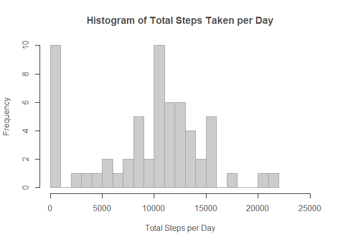
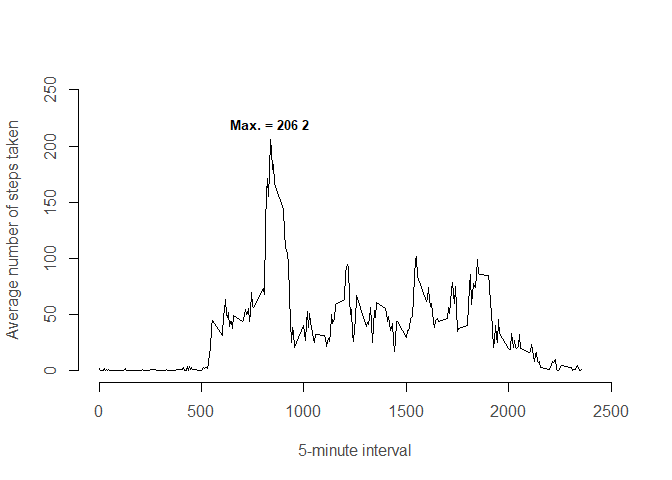
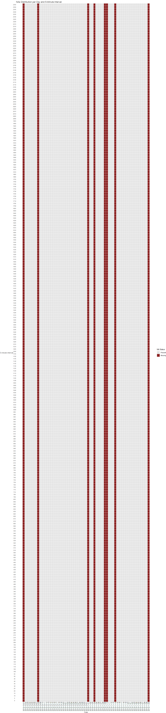
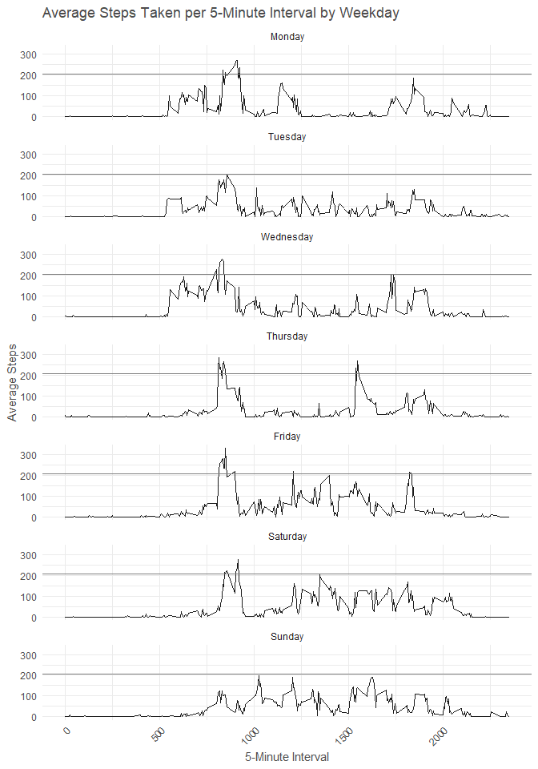
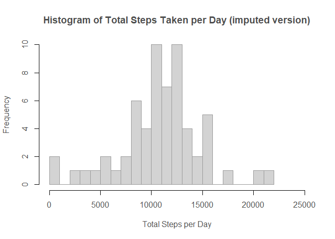
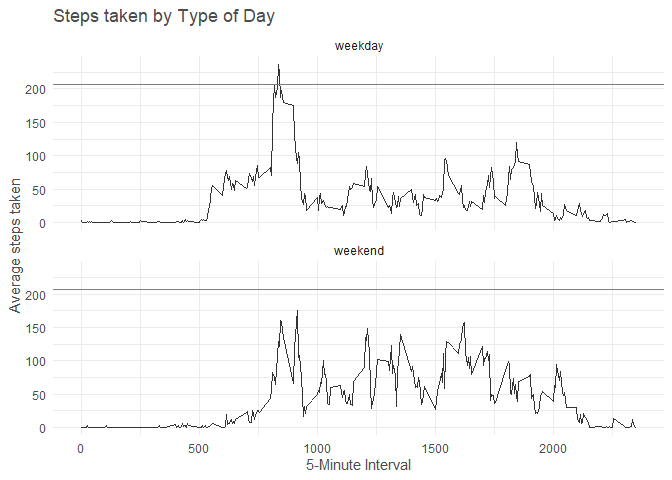
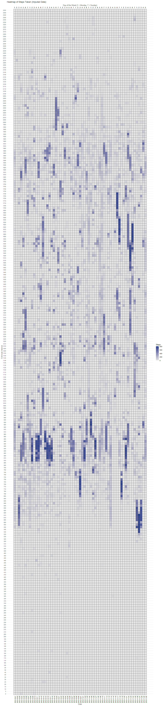

``` r
knitr::opts_chunk$set(echo = TRUE)
options(scipen=999)
```

The following function is important to trace problems in case of error during the code execution.


``` r
sessionInfo() # 
```

```
## R version 4.4.2 (2024-10-31 ucrt)
## Platform: x86_64-w64-mingw32/x64
## Running under: Windows 11 x64 (build 26100)
## 
## Matrix products: default
## 
## 
## locale:
## [1] LC_COLLATE=Portuguese_Brazil.utf8  LC_CTYPE=Portuguese_Brazil.utf8   
## [3] LC_MONETARY=Portuguese_Brazil.utf8 LC_NUMERIC=C                      
## [5] LC_TIME=Portuguese_Brazil.utf8    
## 
## time zone: America/Sao_Paulo
## tzcode source: internal
## 
## attached base packages:
## [1] stats     graphics  grDevices utils     datasets  methods   base     
## 
## loaded via a namespace (and not attached):
##  [1] digest_0.6.37     R6_2.5.1          fastmap_1.2.0     xfun_0.50        
##  [5] cachem_1.1.0      knitr_1.49        htmltools_0.5.8.1 rmarkdown_2.29   
##  [9] lifecycle_1.0.4   cli_3.6.3         sass_0.4.9        jquerylib_0.1.4  
## [13] compiler_4.4.2    rstudioapi_0.17.1 tools_4.4.2       evaluate_1.0.3   
## [17] bslib_0.9.0       yaml_2.3.10       rlang_1.1.5       jsonlite_1.8.9
```
## Loading and preprocessing the data

<br>

At this moment, data has to be checked to confirming if everything is running properly.

<br>


``` r
library(tidyverse)
```

```
## ── Attaching core tidyverse packages ──────────────────────── tidyverse 2.0.0 ──
## ✔ dplyr     1.1.4     ✔ readr     2.1.5
## ✔ forcats   1.0.0     ✔ stringr   1.5.1
## ✔ ggplot2   3.5.1     ✔ tibble    3.2.1
## ✔ lubridate 1.9.4     ✔ tidyr     1.3.1
## ✔ purrr     1.0.2     
## ── Conflicts ────────────────────────────────────────── tidyverse_conflicts() ──
## ✖ dplyr::filter() masks stats::filter()
## ✖ dplyr::lag()    masks stats::lag()
## ℹ Use the conflicted package (<http://conflicted.r-lib.org/>) to force all conflicts to become errors
```

``` r
Sys.setlocale("LC_TIME", "en_US.UTF-8") # This is to fix my R behavior translating dates to my mother language
```

```
## [1] "en_US.UTF-8"
```

``` r
url.df <- "C:\\Users\\Antonio\\Downloads\\repdata_data_activity\\activity.csv"

url.wd <- "C:\\Users\\Antonio\\Downloads\\repdata_data_activity\\"

setwd(url.wd) # setting working directory to work properly

df.raw <- read.csv(file = url.df,header = T, colClasses = c("integer", "Date", "integer"), na.strings = "NA" ) 

str(df.raw) # The documentation states that exists 17568, therefore it's correct
```

```
## 'data.frame':	17568 obs. of  3 variables:
##  $ steps   : int  NA NA NA NA NA NA NA NA NA NA ...
##  $ date    : Date, format: "2012-10-01" "2012-10-01" ...
##  $ interval: int  0 5 10 15 20 25 30 35 40 45 ...
```

``` r
unique(df.raw$date) %>% length() # 61 days
```

```
## [1] 61
```

``` r
df.raw$interval %>% length()/61  # number of intervals per day = 288
```

```
## [1] 288
```

``` r
is.na(df.raw$steps) %>% sum      # 2304 is NA
```

```
## [1] 2304
```

``` r
is.na(df.raw$date) %>% sum       # 0 is NA
```

```
## [1] 0
```

``` r
is.na(df.raw$interval) %>% sum   # 0 is NA
```

```
## [1] 0
```

``` r
# df.raw is ok
```

<br>

Until this point, everything is correct.

<br>

## What is mean total number of steps taken per day?

<br>

The first question is about the number os steps taken daily. To answer that some graphs and numbers can be showed.

<br>


``` r
df.total.steps.per.day <- df.raw %>% group_by(date) %>% summarise(total.steps.per.day = sum(steps,na.rm = T)) # steps taken per day

df.total.steps.per.day$total.steps.per.day %>% length() # it's considering all the days even the ones with NAs.
```

```
## [1] 61
```

``` r
# Therefore the number of days with 0 steps must be checked. It does not make sense.

sum(df.total.steps.per.day$total.steps.per.day == 0) # equal to 8. This problem will be properly addressed after.
```

```
## [1] 8
```

``` r
# Define font as "sans"
par(family = "sans")

hist(df.total.steps.per.day$total.steps.per.day,
     breaks = 20, # 20 breaks to observe pattern more thoroughly
     border = "gray60", col = "gray80",
     xlab = "Total Steps per Day",
     xlim = c(0, 25000), ylim = c(0,10),
     main = "Histogram of Total Steps Taken per Day",
     col.main = "gray30",
     col.lab = "gray30",
     col.axis = "gray30")
```

<!-- -->

``` r
# Roughly can be stated: most of days has around 5000 ~ 16000 steps, with the biggest frequency at nearly 10500 steps

# The mean and median total number of steps taken per day must remove days with NAs that were converted to steps = 0
df.total.steps.per.day.fixed <- df.total.steps.per.day$total.steps.per.day[df.total.steps.per.day$total.steps.per.day>0]

df.total.steps.per.day.fixed %>% length # Equal to 53. Correct!
```

```
## [1] 53
```

``` r
mean.per.day <- round(mean(df.total.steps.per.day.fixed),0)

median.per.day <- median(df.total.steps.per.day.fixed)
```
<br>

The **mean is approximately 10766 steps taken per day**. The **median is 10765 steps taken per day**, this latter statistical value meaning that half of measures are bigger than it and half are smaller. The values are very similar, suggesting some symmetry in the step value, what can be seen partially on the histogram.

<br>

## What is the average daily activity pattern?

<br>


``` r
#What is the average daily activity pattern per 5-minute interval?

df.average.by.interval <- df.raw %>% group_by(interval) %>% summarise(average.by.interval = mean(steps, na.rm = T)) # only possible if na.rm = T  

# Define font as "sans"
par(family = "sans")

plot(x = df.average.by.interval$interval,
     y = df.average.by.interval$average.by.interval,
     type = "l",
     ylab = "Average number of steps taken",
     xlab = "5-minute interval",
     bty = "n",
     xlim = c(0,2500), ylim = c(0,250),
     col.main = "gray30",
     col.lab = "gray30",
     col.axis = "gray30")

# Getting position of max. value
max_y <- max(df.average.by.interval$average.by.interval)  # Find max. value
max_x <- df.average.by.interval$interval[which.max(df.average.by.interval$average.by.interval)]  # Find x value correspondent to y max. value.

# Adding text to the graph
text(max_x, max_y, labels = paste("Max. =", round(max_y),2), pos = 3, col = "black", cex = 0.8, font = 2)
```

<!-- -->

``` r
df.average.by.interval %>% arrange(desc(average.by.interval))
```

```
## # A tibble: 288 × 2
##    interval average.by.interval
##       <int>               <dbl>
##  1      835                206.
##  2      840                196.
##  3      850                183.
##  4      845                180.
##  5      830                177.
##  6      820                171.
##  7      855                167.
##  8      815                158.
##  9      825                155.
## 10      900                143.
## # ℹ 278 more rows
```

``` r
# 8h35 is the peak with 206 steps taken, neighboring values are similar, but the curve is very steep.
```

<br>

## Imputing missing values

<br>

To impute missing values some study must be done to understand the pattern of missing values and create a reasonably way to ascribe values.

<br>


``` r
is.na(df.raw$steps) %>% sum    # 2304 is NA
```

```
## [1] 2304
```

``` r
# Is there a pattern related to the presence of NAs?

df.heatmap <- df.raw %>%
  mutate(is.na = ifelse(is.na(steps), 1, 0)) # ascribing 1 to where step = NA, 0 otherwise

# Converting interval to ordered factor to keep correct temporal sequence
df.heatmap$interval <- factor(df.heatmap$interval, levels = unique(df.heatmap$interval), ordered = TRUE)
```


``` r
# Creating heatmap
ggplot(df.heatmap, aes(x = date, y = interval, fill = factor(is.na))) +
  geom_tile(color = "gray100") +  # Heatmaps blocks
  scale_fill_manual(values = c("0" = "gray90", "1" = "brown4"), 
                    name = "NA Status", 
                    labels = c("Present", "Missing")) +
  scale_x_continuous(
    name = "Date",  
    breaks = df.heatmap$date,
    labels = df.heatmap$date) +
  labs(title = "NAs Distribution per Day and 5-Minute Interval",
       x = "Day",
       y = "5-minute interval") +
  theme_void() +
  theme(axis.text.x = element_text(angle = 90, hjust = 1),
        axis.text.y = element_text(size = 8),
        text = element_text(family = "sans"),
        axis.text = element_text(colour = "gray30"),
        axis.title = element_text(colour = "gray30"),
        plot.title = element_text(colour = "gray30")
        )
```

<!-- -->

<br>

It is possible to confirm that **NA values are present only on specific days**, with the entire day filled with NAs

<br>


``` r
df.heatmap %>% group_by(date) %>% summarise(na.sum = sum(is.na)) %>% filter(na.sum>0)
```

```
## # A tibble: 8 × 2
##   date       na.sum
##   <date>      <dbl>
## 1 2012-10-01    288
## 2 2012-10-08    288
## 3 2012-11-01    288
## 4 2012-11-04    288
## 5 2012-11-09    288
## 6 2012-11-10    288
## 7 2012-11-14    288
## 8 2012-11-30    288
```

``` r
# Confirming 8 full days are NA, with 288 NAs each, therefore all 5-five minute intervals of these days.

#Theses days must be checked
dates.na <- df.heatmap %>% group_by(date) %>% summarise(na.sum = sum(is.na)) %>% filter(na.sum>0) %>% pull(date)

# there is no clear pattern checking difference between days and checking weekdays where NA values appear.
diff(dates.na)
```

```
## Time differences in days
## [1]  7 24  3  5  1  4 16
```

``` r
weekdays(dates.na)
```

```
## [1] "Monday"    "Monday"    "Thursday"  "Sunday"    "Friday"    "Saturday" 
## [7] "Wednesday" "Friday"
```

``` r
# In light of that, there is no clear pattern explaining the existence of NA values.
# This author consider that imputation of values must consider 5-minute interval and weekday. Therefore, the average of 5-minute interval per weekday must be calculated


#First the weekdays must be added
df.weekdays <- df.raw %>% mutate(weekday = weekdays(date))

# Summarising by weekdays and 5-minute interval
df.average.weekday <- df.weekdays %>% group_by(weekday, interval) %>% summarise(average = mean(steps, na.rm = T))
```

```
## `summarise()` has grouped output by 'weekday'. You can override using the
## `.groups` argument.
```

``` r
# Assuring that 'weekday' will a factor ordered correctly
df.average.weekday$weekday <- factor(df.average.weekday$weekday, 
                                     levels = c("Monday", "Tuesday", "Wednesday", "Thursday", 
                                                "Friday", "Saturday", "Sunday"))

# Creating a graph to check if exists difference between the days
```


``` r
ggplot(df.average.weekday, aes(x = interval, y = average)) +
  geom_line(color = "gray10") +
  geom_hline(yintercept = c(206), linewidth = 0.5, colour = "gray50")+
  facet_wrap(~ weekday, ncol = 1, scales = "fixed") +
  labs(title = "Average Steps Taken per 5-Minute Interval by Weekday",
       x = "5-Minute Interval",
       y = "Average Steps") +
  theme_minimal() +
  theme(axis.text.x = element_text(angle = 45, hjust = 1),
         plot.title = element_text(colour = "gray30"),
    axis.title = element_text(colour = "gray30"),
        text = element_text(family = "sans"))
```

<!-- -->

<br>

From the graph above it is possible to observe different patterns along the week.This segmentation by day shows that the maximum of steps taken by weekday sometimes exceeded the maximum of 206 steps calculated previously (average of steps taken per 5-minute interval no matter the day of the week). 

Before, the graph of average number of steps taken by 5-minute interval also showed some patterns. On the other hand, the analysis of NAs cheking days of ocurrence and difference between these days does not revealed anything to be considered. 

In light of this the imputation will be done considering 5-minute interval patterns by weekday.

<br>


``` r
# It's visible that the imputation must follow weekday and 5-minute interval
# Therefore df.average.weekday is the fountain of values

# The folowing procedures find the position of NAs values 
rows.na <- is.na(df.weekdays[,1])
five.minute.na <- df.weekdays[rows.na,3]
weekdays.na <- df.weekdays[rows.na,4]
length(weekdays.na)
```

```
## [1] 2304
```

``` r
df.aux <- data.frame(interval = five.minute.na, weekday = weekdays.na, steps = NA)

str(df.aux)
```

```
## 'data.frame':	2304 obs. of  3 variables:
##  $ interval: int  0 5 10 15 20 25 30 35 40 45 ...
##  $ weekday : chr  "Monday" "Monday" "Monday" "Monday" ...
##  $ steps   : logi  NA NA NA NA NA NA ...
```

``` r
# This for retrives the 5-minutes values average by weekday
for (n in 1:length(df.aux$interval)) {
  
  x <- df.average.weekday %>% filter(weekday == df.aux$weekday[n], interval == df.aux$interval[n]) %>% pull(average)
  
  df.aux[n,3] <- x
  
}

df.imputed <- df.raw
df.imputed[rows.na,1] <- df.aux$steps # ascribing

str(df.imputed)
```

```
## 'data.frame':	17568 obs. of  3 variables:
##  $ steps   : num  1.43 0 0 0 0 ...
##  $ date    : Date, format: "2012-10-01" "2012-10-01" ...
##  $ interval: int  0 5 10 15 20 25 30 35 40 45 ...
```

``` r
# Calculating values after imputing
df.total.steps.per.day.imputed <- df.imputed %>% group_by(date) %>% summarise(total.steps.per.day = sum(steps,na.rm = T)) # steps taken per day

# Define font as "sans"
par(family = "sans")

hist(df.total.steps.per.day.imputed$total.steps.per.day,
     breaks = 20,
     border = "gray60", col = "lightgray",
     xlab = "Total Steps per Day",
     xlim = c(0, 25000), ylim = c(0,10),
     main = "Histogram of Total Steps Taken per Day (imputed version)",
     col.main = "gray30",
     col.lab = "gray30",
     col.axis = "gray30")
```

<!-- -->

``` r
# Roughly can be stated: most of days has around 5000 ~ 16000 steps, with the biggest frequency at nearly 11000 or 13000 steps (indeed there two peaks);

# The mean and median total number of steps taken per day

mean.imputed <- round(mean(df.total.steps.per.day.imputed$total.steps.per.day),0)

median.imputed <- median(df.total.steps.per.day.imputed$total.steps.per.day)

df.total.steps.per.day.imputed %>% arrange(total.steps.per.day)
```

```
## # A tibble: 61 × 2
##    date       total.steps.per.day
##    <date>                   <dbl>
##  1 2012-11-15                  41
##  2 2012-10-02                 126
##  3 2012-10-25                2492
##  4 2012-11-08                3219
##  5 2012-11-20                4472
##  6 2012-10-29                5018
##  7 2012-11-16                5441
##  8 2012-10-26                6778
##  9 2012-11-29                7047
## 10 2012-11-13                7336
## # ℹ 51 more rows
```

<br>

The bar near to zero in this histogram are not days with zeros likewise before. Two days remain strange, with too few steps. They are 15 nov 2012, with only 41 steps, and 2 oct 2012, with only 126 steps. Maybe the user was sick. The cause of so few steps should be investigated with the user.

The **new mean with imputed values is 10821**. The **new median is 11015**. They are a little higher than before.

<br>

## Are there differences in activity patterns between weekdays and weekends?

<br>


``` r
# Comparing weekend versus weekday seems to have differences. Let's visualize.
df.imputed$weekday <- weekdays(df.imputed$date)

df.weekday.weekend <- df.imputed %>%
  mutate(type.of.day = case_when(weekday %in% c("Saturday", "Sunday") ~ "weekend",
                                 TRUE ~ "weekday"))%>%
  mutate(type.of.day = factor(type.of.day, levels = c("weekday", "weekend")))

df.weekday.weekend.average <- df.weekday.weekend %>% group_by(type.of.day, interval) %>% summarise(average.steps = mean(steps)) 
```

```
## `summarise()` has grouped output by 'type.of.day'. You can override using the
## `.groups` argument.
```

``` r
ggplot(df.weekday.weekend.average, aes(x = interval, y = average.steps)) +
  geom_line(color = "gray20") +
  geom_hline(yintercept = c(206), linewidth = 0.5, colour = "gray50") +
  facet_wrap(~ type.of.day, ncol = 1, scales = "fixed") +
  labs(title = "Steps taken by Type of Day",
       x = "5-Minute Interval",
       y = "Average steps taken") +
  theme_minimal() +
  theme(axis.text.x = element_text(angle = 0, hjust = 0.5, colour = "gray30"),
        text = element_text(family = "sans"),
        axis.title = element_text(colour = "gray30"),
        plot.title = element_text(colour = "gray30")
        )
```

<!-- -->

<br>

Actually exist differences between working days (Monday to Friday) and weekends as can be seen looking at the graph above. Again a horizontal line representing 206 steps was plotted to comparison. It is possible do conclude that during working days exist more concentration of steps at morning, reduction after, until evening. During weekends the steps begin later and occur likewise during most part of day and afternoon. Later, during night the average of steps measured last a little longer, ending later at night.

A final graph could be useful for visualizing overall patterns and providing a basis for further analysis. If the median you are using does not allow for proper zooming, you can access this report at https://rpubs.com/antoniovcm/1272155. There, you can zoom in as much as needed to clearly view all the graphs elements.

<br>


``` r
# Creating label to the days and defining as factor.
df.imputed <- df.imputed %>%
  mutate(weekday_num = as.integer(factor(weekdays(date), 
                                         levels = c("Monday", "Tuesday", "Wednesday", 
                                                    "Thursday", "Friday", "Saturday", "Sunday"),
                                         labels = c(1, 2, 3, 4, 5, 6, 7))))

df.imputed$interval <- factor(df.imputed$interval, levels = unique(df.imputed$interval), ordered = TRUE)


df.imputed$interval <- factor(df.imputed$interval, levels = unique(df.imputed$interval), ordered = TRUE)

# Creating a heatmap graph
ggplot(df.imputed, aes(x = date, y = interval, fill = steps)) +
  geom_tile(color = "gray40") +  
  scale_fill_gradient(low = "gray90", high = "royalblue4", name = "Steps") +
  scale_x_continuous(
    name = "Date",  # Bottom legend (Date)
    breaks = df.imputed$date,
    labels = df.imputed$date,
    sec.axis = sec_axis(
      ~ ., name = "Day of the Week (1 = Monday, 7 = Sunday)", 
      breaks = df.imputed$date,
      labels = df.imputed$weekday_num
    )  #  Top legend (days of week)
  ) +
  labs(title = "Heatmap of Steps Taken (Imputed Data)",
       y = "5-Minute Interval") +
  theme_minimal() +
  theme(
    axis.text.x.bottom = element_text(angle = 90, hjust = 1, color = "gray30", size = 8),
    axis.text.x.top = element_text(angle = 0, hjust = 0.5, color = "gray30", size = 10),  
    axis.text.y = element_text(size = 8, colour = "gray30"),
    plot.title = element_text(colour = "gray30"),
    axis.title = element_text(colour = "gray30"),
    text = element_text(family = "sans")
  )
```

<!-- -->

